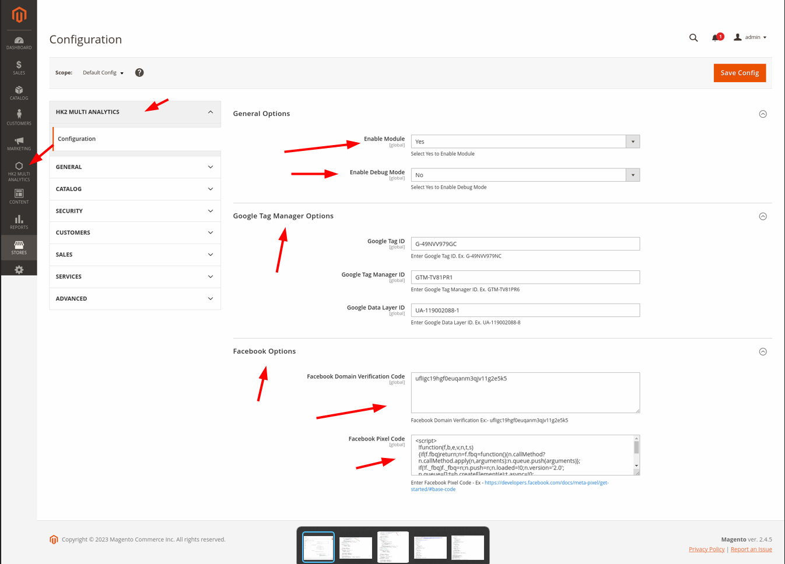

## HK2 Multi Analytics

## Description

HK2 Multi Analytics - Offers easy integration of your ecommerce store with integrating Google Tag Manager, Facebook Domain Verification & Pixel Code in Magento Store saving you the hassle of manual setup. It also helps ContentSquare, etc from tracking data & providing real-time insights to improve the digital experience, increase customer happiness and drive growth.

Easily configure Google Tag Manager & Facebook Pixel on your Magento 2 website. Using Magento 2 Google Tag Manager you can track the behavior of the customers coming onto your website. HK2 Multi Analytics automatically adds the Google Tag Manager code to all pages in your Magento 2 store, enabling site-wide tracking of user data.

## Features

- Quick and Easy Setup
- 100% Open Source, Free & Fully Customizable
- Content Security Policies Support
- You can also enable Facebook pixel functionality for your website

## Support:

- Magento v2.3.x, 2.4.x

## Account & Pricing

This is a Open Source - Free to use Module. No charge or any fee is there to use it.

## How to install

### Method 1: Install ready-to-paste package

[Download Link - HK2 - Add Boostrap5 - (https://github.com/basantmandal/HK2-MultiAnalytics/releases/tag/1.0.0)](https://github.com/basantmandal/HK2-MultiAnalytics/releases/tag/1.0.0)

Download the zip package and unzip it in app/code folder.

## Enable Extension:

```bash
php bin/magento module:enable HK2_MultiAnalytics
```

```bash
php bin/magento setup:upgrade
```

```bash
php bin/magento setup:static-content:deploy
```

```bash
php bin/magento cache:flush
```

## Disable Extension:

```bash
php bin/magento module:disable HK2_MultiAnalytics
```

```bash
php bin/magentosetup:upgrade
```

```bash
php bin/magento setup:static-content:deploy
```

```bash
php bin/magento cache:flush
```

## Backend Settings

Login to Magento Admin -> Add Multi Analytics -> Configuration -> Enable

Please clear the cache after enabling the option.

Once Installed, You can check in Magento Frontend - View Page Source (Right Click - View Page Source) & you can see Google Tag Scripts Added. Please check the screenshot in case you have any doubts.


### Method 2: Install via composer (Recommend)

Run the following command in Magento 2 root folder

```bash
composer require hk2/multianalytics
```

```bash
php bin/magento setup:upgrade
```

```bash
php bin/magento setup:static-content:deploy
```

Note: It is always recommended to install and verify the extension first in the development or staging environment and once verified then install it on production environment.

## Maintenance mode

You may want to enable the maintenance mode when installing or updating the module, especially when working on a production website. To do so, run the two commands below before and after running the other setup commands:

### Enable Maintenance Mode

```
php bin/magento maintenance:enable
```

### Disable Maintenance Mode

```
php bin/magento maintenance:disable
```

## Screenshots

1. Installation Path
   

2. Admin Panel - Settings
   

3. Category Page
   

4. Product Page
   

5. Google Tag Scripts Screenshot
   

6. Facebook Pixel Screenshot
   

# Composer Package Link

https://packagist.org/packages/hk2/multianalytics
