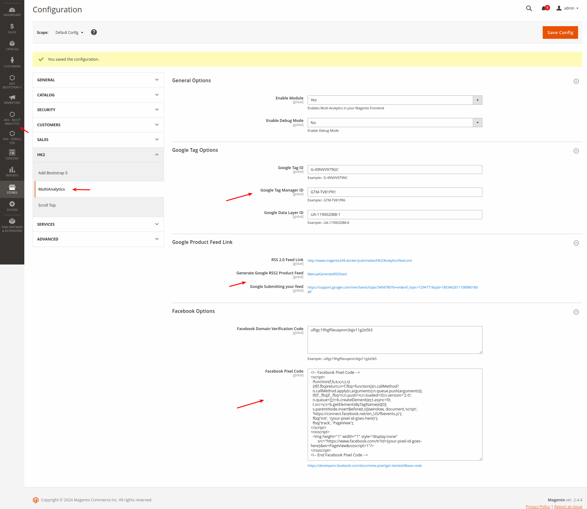
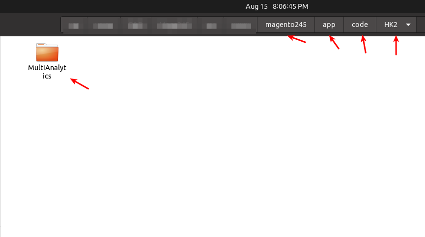
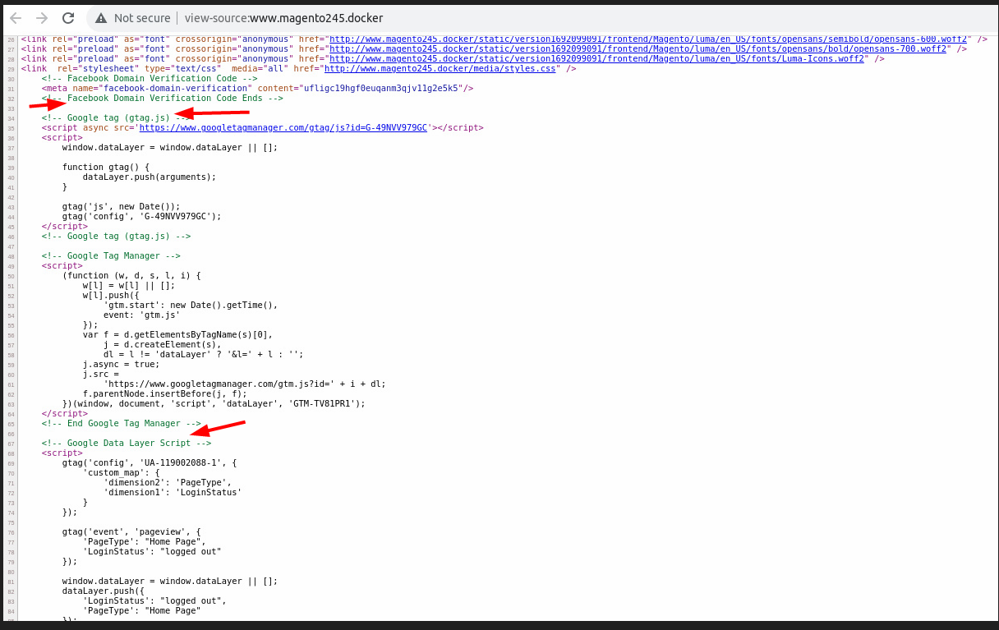
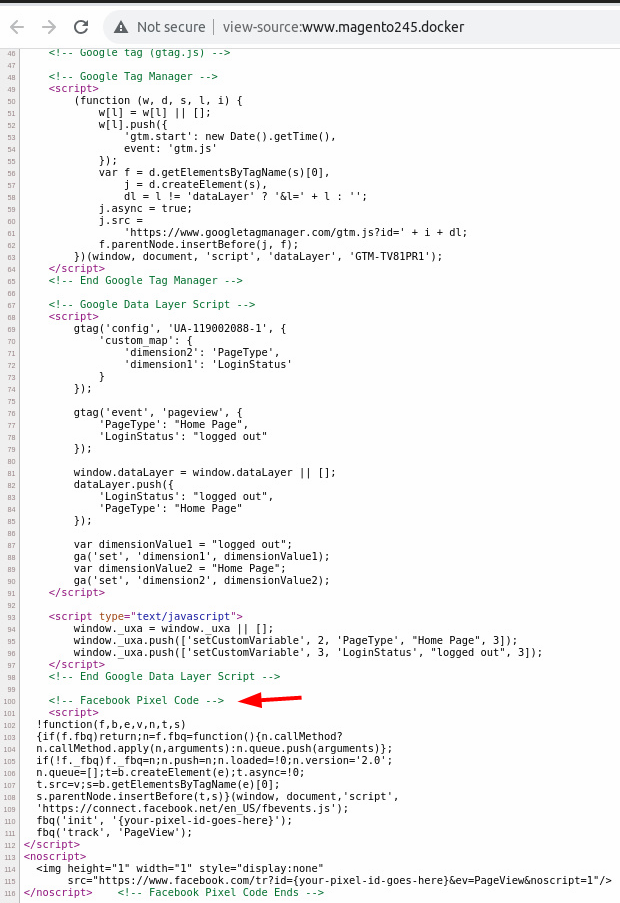
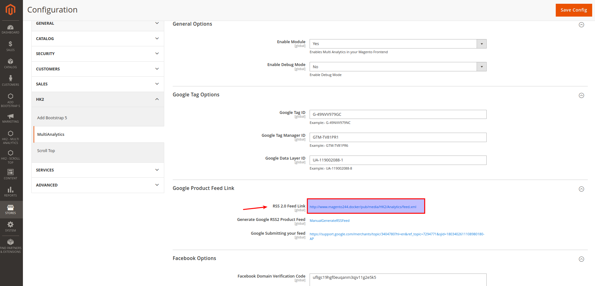

# HK2 Multi Analytics

HK2 Multi Analytics - Offers easy integration of your ecommerce store with integrating Google Tag Manager, Facebook Domain Verification & Pixel Code in Magento Store saving you the hassle of manual setup. It also helps ContentSquare, etc from tracking data & providing real-time insights to improve the digital experience, increase customer happiness and drive growth.

Easily configure Google Tag Manager & Facebook Pixel on your Magento 2 website. Using Magento 2 Google Tag Manager you can track the behavior of the customers coming onto your website. HK2 Multi Analytics automatically adds the Google Tag Manager code to all pages in your Magento 2 store, enabling site-wide tracking of user data.

Added Google Product RSS Feed (Product feed for Google Shopping) - Just add the RSS 2.0 Feed Link from


## 🧐 Features

- Quick and Easy Setup
- 100% Open Source, Free & Fully Customizable
- Content Security Policies Support
- You can also enable Facebook pixel functionality for your website

## 💰 Account & Pricing

This is a Open Source - Free to use Module. No charge or any fee is there to use it.

## 🚀 Supported Version

- Magento v2.3.5, 2.4.x

## How to install

### Method 1: Install ready-to-paste package

[Download Link - HK2 - Add Boostrap5 - (https://github.com/basantmandal/HK2-MultiAnalytics/releases/tag/2.0.0)](https://github.com/basantmandal/HK2-MultiAnalytics/releases/tag/2.0.0)

Download the zip package and unzip it in app/code folder.

## Enable Extension

```bash
php bin/magento module:enable HK2_MultiAnalytics
```

```bash
php bin/magento setup:upgrade
```

```bash
php bin/magento setup:static-content:deploy
```

```bash
php bin/magento cache:flush
```

## Disable Extension:

```bash
php bin/magento module:disable HK2_MultiAnalytics
```

```bash
php bin/magentosetup:upgrade
```

```bash
php bin/magento setup:static-content:deploy
```

```bash
php bin/magento cache:flush
```

## Backend Settings

Login to Magento Admin -> Add Multi Analytics -> Configuration -> Enable

Please clear the cache after enabling the option.

Once Installed, You can check in Magento Frontend - View Page Source (Right Click - View Page Source) & you can see Google Tag Scripts Added. Please check the screenshot in case you have any doubts.


### Method 2: Install via composer (Recommend)

Run the following command in Magento 2 root folder

```bash
composer require hk2/multianalytics
```

```bash
php bin/magento setup:upgrade
```

```bash
php bin/magento setup:static-content:deploy
```

Note: It is always recommended to install and verify the extension first in the development or staging environment and once verified then install it on production environment.

## Screenshots

1. Installation Path
   

2. Admin Panel - Settings
   

3. Category Page
   

4. Product Page
   

5. Google Tag Scripts Screenshot
   

6. Facebook Pixel Screenshot
   

7. Google RSS Feed URL - Link Screenshot
   

## 🛠️ Maintenance mode

You may want to enable the maintenance mode when installing or updating the module, especially when working on a production website. To do so, run the two commands below before and after running the other setup commands:

### Enable Maintenance Mode

```bash
php bin/magento maintenance:enable
```

### Disable Maintenance Mode

```bash
php bin/magento maintenance:disable
```

## 🤫 Privacy

This extension does not read, change, store, or transmit any of your personal data (e.g., logins, passwords, messages, contacts) from any of the sites or your computer in absolutely any form.

## 📫 Support

For support or any bug report or changes mail me at - <support@hashtagkitto.co.in>

## 🐞 Bug Report

Please open an [issue](https://github.com/basantmandal/HK2-MultiAnalytics/issues) on GitHub.

When filing a bug remember that the better written the bug is, the more likely it is to be fixed.

You can also reach us at <support@hashtagkitto.co.in>

## 🍰 Contribution Guidelines 💖

Contributions are welcome! If you’d like to contribute to this project:

- Fork the repository.
- Create a new branch (git checkout -b feature/your-feature-name).
- Make your changes and commit them (git commit -am 'Add new feature').
- Push to the branch (git push origin feature/your-feature-name).
- Open a pull request.

**Please Note** :- I may be a bit delayed in responding or slow in responding due to low amount of free time. I apologize for the inconvenience and I appreciate your patience

## 📜 License

Copyright (c) 2022, 2025 [**Basant Mandal (HK2 - Hash Tag Kitto)**](https://www.basantmandal.in/)

## 🤝 Consent

By using HK2 AddBootstrap 5 Whitelisting Module, you hereby consent to our disclaimer and agree to its terms.

## 📢 Disclaimer

> **Basant Mandal (HK2 - Hash Tag Kitto)** does not make any warranties about the completeness, reliability and accuracy of this image or its related products. Any action you take upon the information you find here is strictly at your own risk.

> **Basant Mandal (HK2 - Hash Tag Kitto)** will not be liable for any losses and/or damages in connection with the use of our website.

## 💖Like my work? Help Us

Please rate my project or give some stars at [https://github.com/basantmandal/HK2-MultiAnalytics](https://github.com/basantmandal/HK2-MultiAnalytics). You can also contribute to make my Open Source Contribution more frequent and help others - [https://www.buymeacoffee.com/basantmandal](https://www.buymeacoffee.com/basantmandal) or [https://www.basantmandal.in/buymecoffee](https://www.basantmandal.in/buymecoffee)

## 📫 Feedback

If you have any feedback, please reach out to us at <support@hashtagkitto.co.in>

## 🛡️ License

[](https://github.com/basantmandal/HK2-MultiAnalytics/blob/main/LICENSE.txt)

## 🔗 Links

[](https://www.basantmandal.in/)
[](https://www.linkedin.com/in/basantmandal/)
